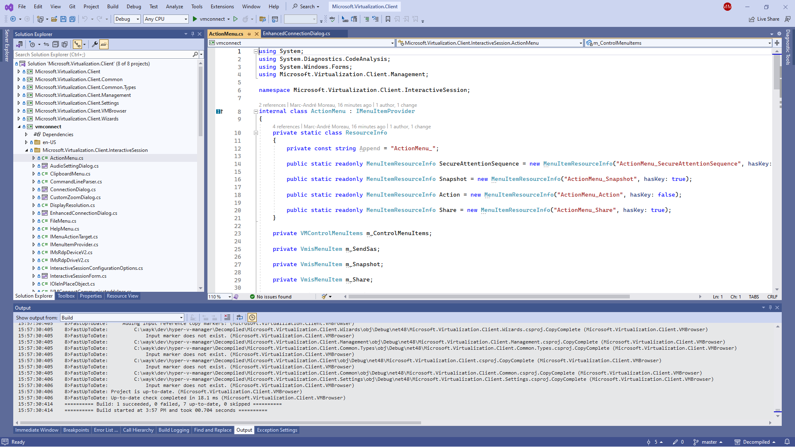

# Hyper-V Manager: Unofficial Patching

## Recompiling Hyper-V Manager from source

Install the [ILSpy](https://github.com/icsharpcode/ILSpy) command-line tool:

```powershell
dotnet tool install ilspycmd -g
```

Install [ripgrep](https://github.com/BurntSushi/ripgrep#installation):

```powershell
winget install BurntSushi.ripgrep.MSVC
```

Bootstrap the decompiled project:

```powershell
.\bootstrap.ps1
```

Enter a Visual Studio developer environment and build the decompiled project:

```powershell
Install-Module -Name VsDevShell
Enter-VsDevShell
cd Decompiled && dotnet restore && msbuild
start .\Microsoft.Virtualization.Client.sln
```

You should now have a buildable Visual Studio solution:



Running the recompiled project is still a work in progress partially covered in the next section.

## Running recompiled Hyper-V Manager

Create the "C:\Hyper-V\Manager" directory, copy the build output there, then copy hvmanager.msc to the same directory.

From this repository, import hvmanager.reg to register the MMC component with a different GUID than the original Hyper-V Manager, and point it to "C:\Hyper-V\Manager" as the install path.

You can now try launch mmc.exe with hvmanager.msc, ideally from an elevated PowerShell terminal to avoid the UAC prompt:

```powershell
mmc.exe "C:\Hyper-V\Manager\hvmanager.msc"
```

Tada! You now have a working recompiled Hyper-V Manager to experiment with.
